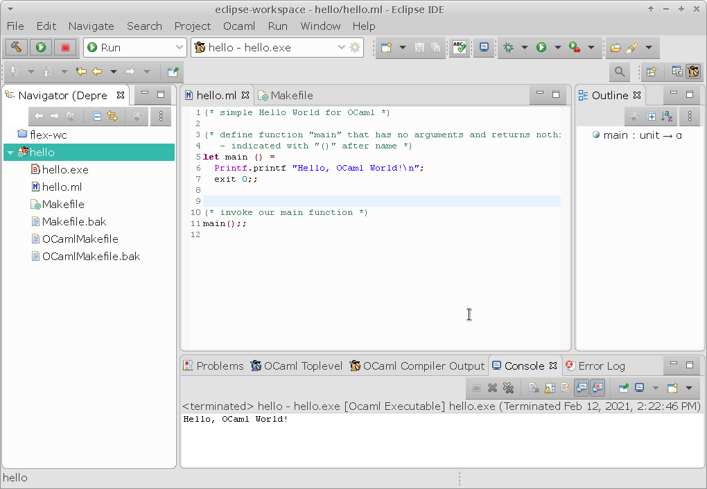

# Examples in OCaml language

(Early) Work in Progress!

I use:
- openSUSE LEAP 15.2 with XFCE
- Eclipse 2020-03 release CDT C/C++ Edition

Installed additional `OCaIDE` plugin from Site:
- http://www.algo-prog.info/ocaide

These packages must be installed under openSUSE LEAP 15.2
so OCaml examples can be edited and build:

```bash
sudo zypper in ocaml ocaml-camlp4-devel ocaml-ocamldoc make
```

Example of `hello/` project in Eclipse with OCaIDE plugin:




## Project list

* `hello/` - initial trivial Hello World example.


